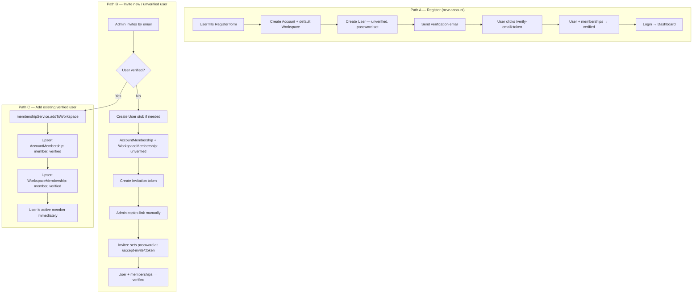
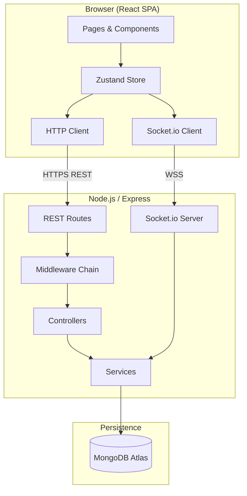
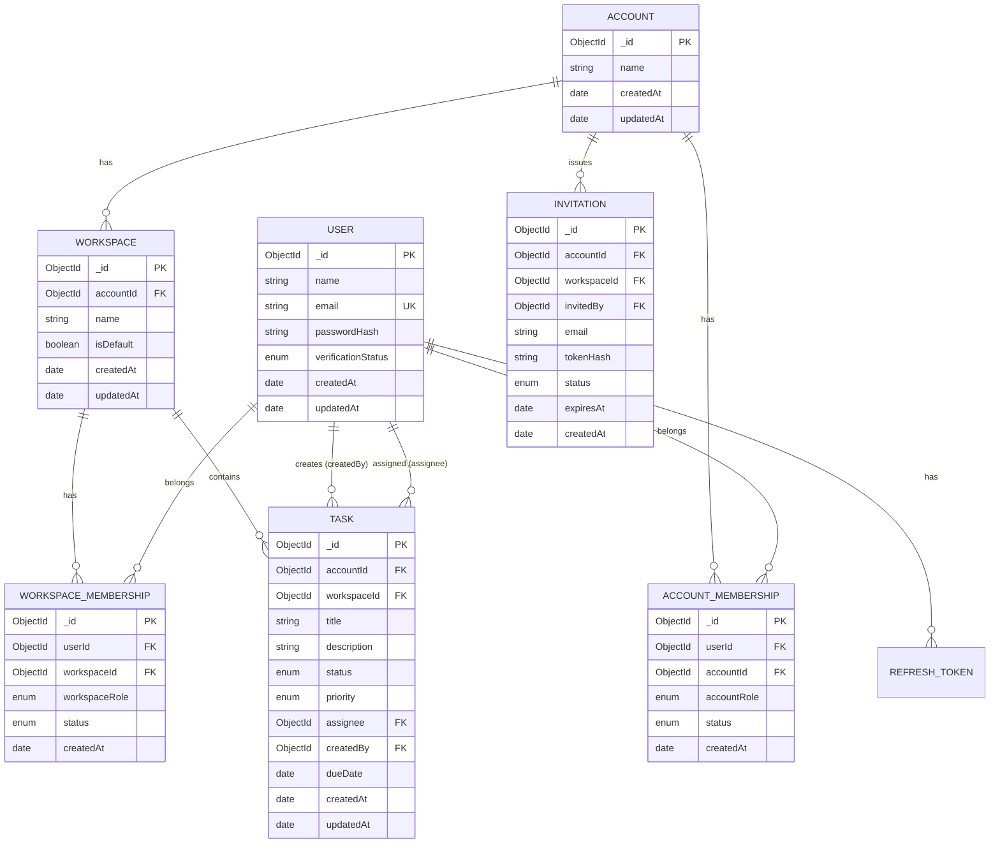
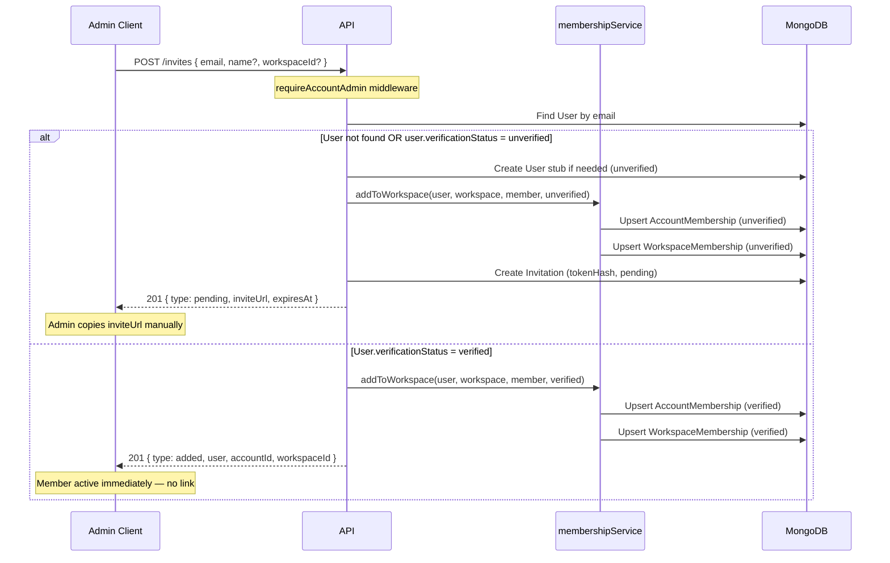
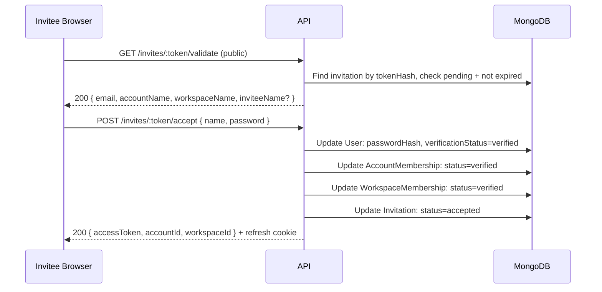
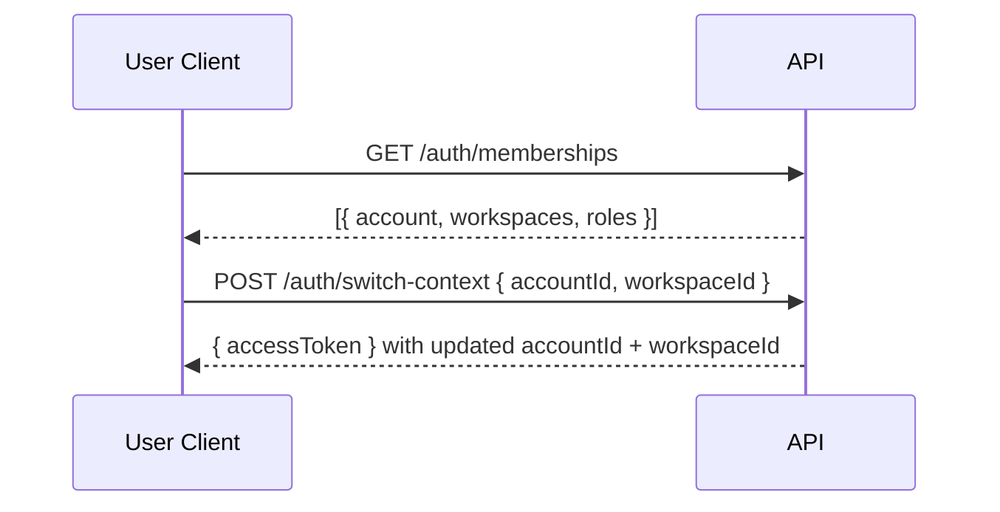
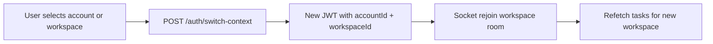

# TruBotAI Task Manager — Architecture

> **Status:** Implemented design document (v2.4 — email verification + password reset)  
> **Scope:** Part 5 Practical Coding Challenge (MERN Task Management API + Real-time UI)  
> **Related:** See [AMBIGUITIES_AND_ASSUMPTIONS.md](./AMBIGUITIES_AND_ASSUMPTIONS.md) for open questions and chosen defaults

---

## 1. Executive Summary

This document defines the architecture for a **multi-tenant task management application** built on the MERN stack. Each registration creates an isolated **Account** with a **default Workspace**. The registrant becomes **account admin** and **workspace admin**. Additional users are added by an admin via invite:

- **New / unverified users** — admin shares an invite link manually; user sets password to become verified
- **Already verified users** — added to the account and workspace **immediately** (no link, no password step)

A user may belong to **multiple accounts** and **multiple workspaces per account**. **Adding a user to a workspace always creates account membership** on the parent account. Within an account, users can **switch workspaces**, **create workspaces** (account admin), and **manage workspace membership** (account admin or workspace admin).

Design priorities (aligned with TruBotAI SME context and assignment evaluation criteria):

| Priority | Rationale |
|----------|-----------|
| **Ship a complete vertical slice fast** | 3–4 day window; one default workspace per account keeps scope manageable |
| **Demonstrate multi-tenant data isolation** | Directly addresses Part 1 Q&A on MongoDB multi-tenant schema design |
| **Demonstrate lead-level structure** | Clear separation of routes → controllers → services → models |
| **Security by default** | bcrypt, JWT, tenant scoping, input validation, invite token security |
| **SME-friendly UX** | Simple register → invite → accept flow; plain language |
| **Document trade-offs** | Shows architectural judgment, not just code volume |

All unresolved scope questions are tracked separately in `AMBIGUITIES_AND_ASSUMPTIONS.md`. Implementation proceeds against **confirmed assumptions** unless overridden.

---

## 2. Domain Model Overview

### 2.1 Core Concepts

| Concept | Description |
|---------|-------------|
| **Account** | Top-level tenant boundary. One account per registration. |
| **Workspace** | Container for tasks within an account. Default workspace created on registration. |
| **User** | A person with global identity. Email globally unique. May belong to many accounts/workspaces. |
| **AccountMembership** | Links User ↔ Account with role (`admin` \| `member`) and status (`verified` \| `unverified`) |
| **WorkspaceMembership** | Links User ↔ Workspace with role (`admin` \| `member`) and status. **Always paired with account membership.** |
| **Invitation** | Tokenized link for **new/unverified** users only — not created for already-verified users |
| **Task** | Scoped to a single workspace |

### 2.2 Onboarding Flows



---

## 3. System Context



**Request flow (REST):** Client → CORS/Helmet → Rate limit → Auth JWT → **Tenant scope** → Validation → Controller → Service → Mongoose → MongoDB

**Real-time flow:** Task mutation in Service → persist to DB → emit to `workspace:{workspaceId}` room → connected clients in that workspace update local state

---

## 4. Technology Choices

### 4.1 Summary Table

| Layer | Choice | Alternatives Considered |
|-------|--------|-------------------------|
| Runtime | **Node.js 20 LTS** | Node 18 |
| Language | **TypeScript** | JavaScript |
| Backend framework | **Express 4** | Fastify, NestJS |
| ODM | **Mongoose 8** | Native MongoDB driver |
| Real-time | **Socket.io 4** | Native WebSockets, SSE |
| Auth | **JWT + refresh token** | Session cookies only |
| Validation | **Zod** | express-validator, Joi |
| Invite tokens | **crypto.randomBytes + SHA-256 hash** | uuid v4 (less entropy) |
| Frontend | **React 18 + Vite** | CRA, Next.js |
| Routing | **React Router 6** | TanStack Router |
| State | **Zustand** | Redux Toolkit, Context API |
| HTTP client | **Axios** | fetch wrapper |
| Styling | **Tailwind CSS** | MUI, Chakra UI |
| API docs | **Swagger (OpenAPI 3)** | Postman collection only |
| Database | **MongoDB Atlas** | Self-hosted MongoDB |
| Backend hosting | **Render** | Railway, Fly.io |
| Frontend hosting | **Vercel** | Netlify |

*Technology rationale unchanged from v1 — see Section 4.2 in prior revision; TypeScript, Express, Socket.io, Zustand choices still apply.*

### 4.2 Multi-tenant Specific Choices

| Decision | Choice | Why |
|----------|--------|-----|
| Tenant key on tasks | `workspaceId` (+ denormalized `accountId`) | Fast queries; workspace is task boundary |
| Membership model | Separate join collections; **workspace add always upserts account membership** | Users can belong to many accounts; roles differ per context |
| Verified user re-invite | Immediate membership — no Invitation record | Simpler UX for users already in the system |
| Invite tokens | Stored hashed (like passwords) | Raw token only returned once to admin; DB leak doesn't expose usable links |
| Email (auth flows) | **Mailpit (local) + Resend (production)** | Gmail SMTP, SendGrid — Mailpit is zero-cost for dev; Resend free tier for deploy |
| Workspace invite delivery | **Manual link share** | Email invite — unchanged; admin copies link from UI |
| Workspace switcher | **Full UI + API** | List/switch/create workspaces; manage members per workspace |

---

## 5. Data Model

### 5.1 Design Principles

1. **Account-level isolation** — no cross-account data access; all queries scoped by `accountId` or `workspaceId`
2. **Explicit membership join tables** — roles and verification status live on memberships, not on User alone
3. **Workspace implies account** — `membershipService.addToWorkspace()` always upserts both AccountMembership and WorkspaceMembership in one transaction; no workspace-only membership
4. **Global user verification** — `User.verificationStatus` becomes `verified` after **email verification** (register) or **invite accept** (invited users). Verified users joining new accounts get verified memberships immediately
5. **Denormalize `accountId` on Task** — avoids extra join on every tenant-scoped query
6. **Index for every filter the dashboard uses** — workspaceId, status, assignee, dueDate
7. **Hard delete for tasks** — keeps scope minimal (see Q12)

### 5.2 Entity Relationship Diagram



### 5.3 Account Schema

```typescript
Account {
  _id:        ObjectId
  name:       string       // default: "{userName}'s Account" or from register form
  createdAt:  Date
  updatedAt:  Date
}
```

### 5.4 Workspace Schema

```typescript
Workspace {
  _id:        ObjectId
  accountId:  ObjectId     // ref Account, required, indexed
  name:       string       // default: "Default Workspace"
  isDefault:  boolean      // true for auto-created workspace; one per account
  createdAt:  Date
  updatedAt:  Date
}

// Indexes
{ accountId: 1, isDefault: 1 }
{ accountId: 1, name: 1 }    unique (workspace names unique within account)
```

### 5.5 User Schema

```typescript
User {
  _id:                 ObjectId
  name:                string       // required, 2–100 chars
  email:               string       // required, unique globally, lowercase
  passwordHash:        string       // optional until invite accepted; select: false
  verificationStatus:  'verified' | 'unverified'
  createdAt:           Date
  updatedAt:           Date
}

// Indexes
{ email: 1 }  unique
```

**Verification states (global on User):**
| Status | Meaning | Can login? |
|--------|---------|------------|
| `verified` | Password set (via register or invite accept) | Yes |
| `unverified` | Invited but password not yet set | No |

- Registrants are `verified` immediately at signup
- New invitees start `unverified` until they accept an invite link
- Once `verified`, a user stays verified forever — joining additional accounts/workspaces creates **verified memberships immediately** (no re-verification)

### 5.6 AccountMembership Schema

```typescript
AccountMembership {
  _id:          ObjectId
  userId:       ObjectId     // ref User
  accountId:    ObjectId     // ref Account
  accountRole:  'admin' | 'member'
  status:       'verified' | 'unverified'
  createdAt:    Date
}

// Indexes
{ userId: 1, accountId: 1 }   unique
{ accountId: 1, status: 1 }
```

### 5.7 WorkspaceMembership Schema

```typescript
WorkspaceMembership {
  _id:            ObjectId
  userId:         ObjectId     // ref User
  workspaceId:    ObjectId     // ref Workspace
  workspaceRole:  'admin' | 'member'
  status:         'verified' | 'unverified'
  createdAt:      Date
}

// Indexes
{ userId: 1, workspaceId: 1 }   unique
{ workspaceId: 1, status: 1 }
```

**Invariant:** A WorkspaceMembership must have a corresponding AccountMembership on the workspace's parent account. Enforced by `membershipService.addToWorkspace()`.

### 5.8 Invitation Schema

```typescript
Invitation {
  _id:          ObjectId
  accountId:    ObjectId     // ref Account
  workspaceId:  ObjectId     // ref Workspace (default workspace)
  invitedBy:    ObjectId     // ref User (account admin)
  email:        string       // invitee email, lowercase
  tokenHash:    string       // SHA-256 of raw token; raw token never stored
  status:       'pending' | 'accepted' | 'expired' | 'revoked'
  expiresAt:    Date         // default: createdAt + 7 days
  createdAt:    Date
}

// Indexes
{ tokenHash: 1 }              unique
{ accountId: 1, email: 1, status: 1 }
{ expiresAt: 1 }              TTL or cron cleanup for expired
```

### 5.9 Task Schema

```typescript
Task {
  _id:          ObjectId
  accountId:    ObjectId     // ref Account, denormalized for tenant queries
  workspaceId:  ObjectId     // ref Workspace, required
  title:        string       // required, 1–200 chars
  description:  string       // optional, max 2000 chars
  status:       'todo' | 'in_progress' | 'done'
  priority:     'low' | 'medium' | 'high'
  assignee:     ObjectId     // ref User, must be verified workspace member
  createdBy:    ObjectId     // ref User
  dueDate:      Date         // optional
  createdAt:    Date
  updatedAt:    Date
}

// Indexes
{ workspaceId: 1, status: 1 }
{ workspaceId: 1, assignee: 1, status: 1 }
{ workspaceId: 1, dueDate: 1 }
{ accountId: 1 }                        // tenant isolation audits
```

### 5.10 RefreshToken Schema

```typescript
RefreshToken {
  _id:        ObjectId
  userId:     ObjectId
  tokenHash:  string
  expiresAt:  Date
  createdAt:  Date
}

// Indexes
{ userId: 1 }
{ expiresAt: 1 }  TTL
```

---

## 6. Registration & Invitation Flows (Detailed)

### 6.1 Register — New Account

```mermaid
sequenceDiagram
    participant C as Client
    participant A as API
    participant D as MongoDB
    participant E as Email (Mailpit/Resend)

    C->>A: POST /auth/register { name, email, password, accountName? }
    A->>D: Begin transaction
    A->>D: Create Account
    A->>D: Create Workspace (isDefault: true)
    A->>D: Create User (verificationStatus: unverified, passwordHash)
    A->>D: Create AccountMembership (admin, unverified)
    A->>D: Create WorkspaceMembership (admin, unverified)
    A->>D: Commit transaction
    A->>E: Send verification email (SMTP / Resend)
    A-->>C: 201 { requiresVerification: true, email, message }
    C->>A: POST /auth/verify-email/:token
    A->>D: Mark user + memberships verified; consume token
    A-->>C: 200 { accessToken, user, account, workspace }
```

**Atomicity:** Account + Workspace + User + both Memberships created in a MongoDB transaction. Partial failure rolls back.

### 6.2 Admin Invites / Adds Member (Branching Flow)



**`membershipService.addToWorkspace()`** (single transaction):
1. Load workspace → resolve parent `accountId`
2. Upsert `AccountMembership` for `(userId, accountId)` — create or leave existing; set status/role as specified
3. Upsert `WorkspaceMembership` for `(userId, workspaceId)`
4. If user is globally verified, both memberships get `status: verified`

**Invite URL format (pending path only):** `{CLIENT_URL}/accept-invite/{rawToken}`

The raw token is returned **once** in the create-invite response. Only `tokenHash` is persisted.

### 6.3 Invitee Accepts Invitation (new / unverified users only)



> **Note:** This flow applies only to users who are not yet globally verified. Verified users are added via Path C (Section 6.2) without an invitation token.

### 6.5 Email Verification & Password Reset

```mermaid
sequenceDiagram
    participant U as User
    participant A as API
    participant M as Mailpit/Resend
    participant D as MongoDB

    Note over U,D: Email verification (after register)
    U->>A: POST /auth/resend-verification { email }
    A->>D: Create VerificationToken (email_verification)
    A->>M: Send verify link
    U->>M: Open inbox (local: http://localhost:8025)
    U->>A: POST /auth/verify-email/:token
    A->>D: Activate user + memberships; mark token used

    Note over U,D: Password reset
    U->>A: POST /auth/forgot-password { email }
    A->>D: Create VerificationToken (password_reset)
    A->>M: Send reset link (always 200 — no email enumeration)
    U->>A: POST /auth/reset-password/:token { password }
    A->>D: Update passwordHash; revoke refresh tokens
```

**Token storage:** Raw tokens never stored — only SHA-256 hash (same pattern as invitations). TTL indexes on `expiresAt`.

**Providers:**

| Environment | Provider | Config |
|-------------|----------|--------|
| Local dev | Mailpit (Docker) | API container: `SMTP_HOST=mailpit`; host-only tools: `localhost:1025` |
| Production | Resend | `EMAIL_PROVIDER=resend`, `RESEND_API_KEY`, verified `EMAIL_FROM` |

### 6.6 Multi-Account Context

A verified user may belong to multiple accounts (own registration + invitations to others).



Login defaults to the account created at registration (where user is admin). User switches context to access other accounts they belong to.

---

## 7. API Design

### 7.1 Conventions

| Convention | Choice |
|------------|--------|
| Base path | `/api/v1` |
| Tenant context | From JWT (`accountId`, `workspaceId`) — not from client body |
| Errors | `{ success: false, message: string, errors?: FieldError[] }` |
| Success | `{ success: true, data: T }` |
| Pagination | `?page=1&limit=20` |

### 7.2 Endpoints

#### Auth

| Method | Path | Auth | Description |
|--------|------|------|-------------|
| POST | `/api/v1/auth/register` | No | Create account + user; send verification email |
| POST | `/api/v1/auth/login` | No | Login (email-verified users only) |
| POST | `/api/v1/auth/logout` | Yes | Revoke refresh token |
| POST | `/api/v1/auth/refresh` | Cookie | Issue new access token |
| GET | `/api/v1/auth/me` | Yes | Current user + active account + workspace context |
| GET | `/api/v1/auth/memberships` | Yes | Nested accounts → workspaces with roles |
| POST | `/api/v1/auth/switch-context` | Yes | Switch active account **and** workspace; new JWT |
| GET | `/api/v1/auth/verify-email/:token/validate` | No | Validate verification link |
| POST | `/api/v1/auth/verify-email/:token` | No | Verify email; issue JWT |
| POST | `/api/v1/auth/resend-verification` | No | Resend verification email (rate limited) |
| POST | `/api/v1/auth/forgot-password` | No | Send password reset email (rate limited) |
| GET | `/api/v1/auth/reset-password/:token/validate` | No | Validate reset link |
| POST | `/api/v1/auth/reset-password/:token` | No | Set new password |

#### Workspaces

| Method | Path | Auth | Description |
|--------|------|------|-------------|
| GET | `/api/v1/workspaces` | Yes | Workspaces in current account where user is verified member |
| POST | `/api/v1/workspaces` | Account admin | Create workspace; creator becomes workspace admin |
| GET | `/api/v1/workspaces/:id/members` | Workspace member | List verified members of workspace |
| POST | `/api/v1/workspaces/:id/members` | Account admin or workspace admin | Add user to workspace (`membershipService.addToWorkspace`) |
| DELETE | `/api/v1/workspaces/:id/members/:userId` | Account admin or workspace admin | Remove user from workspace (retains account membership); blocked for last admin |
| PATCH | `/api/v1/workspaces/:id/members/:userId` | Account admin or workspace admin | Change workspace role (`admin` \| `member`); cannot demote last admin |

#### Invitations & members (account admin only)

| Method | Path | Auth | Description |
|--------|------|------|-------------|
| POST | `/api/v1/invites` | Admin | Invite by email — pending link OR immediate add (see 6.2) |
| GET | `/api/v1/invites` | Admin | List pending invitations (unverified users only) |
| GET | `/api/v1/members` | Admin | List all account members (verified + unverified) |
| DELETE | `/api/v1/invites/:id` | Admin | Revoke pending invite |
| GET | `/api/v1/invites/:token/validate` | No | Validate token for accept page |
| POST | `/api/v1/invites/:token/accept` | No | Set password; activate unverified member |

#### Users (assignee dropdown)

| Method | Path | Auth | Description |
|--------|------|------|-------------|
| GET | `/api/v1/users` | Yes | Verified members of current workspace |

#### Tasks (workspace-scoped)

| Method | Path | Auth | Description |
|--------|------|------|-------------|
| GET | `/api/v1/tasks` | Yes | List tasks in workspace (filtered, paginated) |
| GET | `/api/v1/tasks/:id` | Yes | Get single task (workspace scope enforced) |
| POST | `/api/v1/tasks` | Yes | Create task in workspace |
| PUT | `/api/v1/tasks/:id` | Yes | Update task |
| DELETE | `/api/v1/tasks/:id` | Yes | Delete task |

### 7.3 JWT Payload

```typescript
{
  userId: string
  accountId: string
  workspaceId: string       // active default workspace in v1
  accountRole: 'admin' | 'member'
  workspaceRole: 'admin' | 'member'
}
```

### 7.4 Authorization Rules

| Action | Account Admin | Workspace Admin | Member |
|--------|---------------|-----------------|--------|
| Create workspace | Yes | No | No |
| Switch workspace (own memberships) | Yes | Yes | Yes |
| Add/remove workspace member | Any workspace | Own workspace(s) only | No |
| Create account invite | Yes | No | No |
| View all workspace tasks | Yes (in member workspaces) | Yes (own workspace) | Created + assigned only |
| Create task | Yes | Yes | Yes |
| Update task | Yes | Yes | If creator or assignee |
| Delete task | Yes | Yes | If creator |
| Assign to verified member | Yes | Yes | Yes |
| List unverified members | Yes | No | No |

---

## 8. Middleware Chain

```
Request
  → helmet()
  → cors(credentials: true)
  → express.json()
  → cookieParser()
  → mongoSanitize()
  → rateLimiter (global)
  → rateLimiter (auth + invite routes)
  → router
      → authenticateJWT              // Verify token; attach user context
      → requireVerifiedUser          // Block unverified users
      → requireAccountAdmin          // Invite routes only
      → scopeToWorkspace             // Inject workspaceId filter
      → validate(schema)
      → controller
  → notFoundHandler
  → errorHandler
```

**Tenant scoping middleware** ensures `req.workspaceId` and `req.accountId` from JWT are applied to all task queries — clients cannot override tenant by passing a different ID in the body.

---

## 9. Real-time Architecture

### 9.1 Rooms

| Room | Purpose |
|------|---------|
| `workspace:{workspaceId}` | All verified members viewing that workspace's dashboard |

On socket connect (after JWT auth), server joins user to `workspace:{workspaceId}` from token.

### 9.2 Events

| Event | Payload | Trigger |
|-------|---------|---------|
| `task:created` | `{ task }` | POST /tasks |
| `task:updated` | `{ task }` | PUT /tasks/:id |
| `task:deleted` | `{ taskId, workspaceId }` | DELETE /tasks/:id |
| `member:added` | `{ user, workspaceId }` | Verified user added to workspace (Path C) |
| `member:verified` | `{ userId, name }` | Invite accepted (Path B) |

**Isolation:** Events emitted only to the task's workspace room. No cross-account leakage.

---

## 10. Frontend Architecture

### 10.1 Page Structure

```
/                           → redirect to /dashboard or /login
/login                      → LoginPage
/register                   → RegisterPage → check email screen
/verify-email/:token        → VerifyEmailPage (public)
/forgot-password            → ForgotPasswordPage (public)
/reset-password/:token      → ResetPasswordPage (public)
/accept-invite/:token       → AcceptInvitePage (public — set password)
/dashboard                  → DashboardPage / TaskBoard (protected)
  ├── TaskFilters (+ My tasks, clear filters)
  ├── TaskTable / mobile cards (+ status & due-date chips)
  ├── Load more pagination
  └── TaskModal (+ comments panel)
/settings/team              → TeamPage (invites; admin form, member message)
/settings/workspaces        → WorkspacesPage (list + create workspace)
/settings/workspaces/:id/members → WorkspaceMembersPage (add/remove/change roles)
```

### 10.2 Layout & Navigation

```
AppLayout (protected shell)
├── TopNav
│   ├── Home icon → TaskBoard
│   ├── AccountSwitcher          ← name only when single account
│   ├── WorkspaceSwitcher        ← name only when single workspace
│   ├── NavLinks (TaskBoard, Workspaces, Team)
│   └── User name + Logout
├── MainContent (Outlet)
└── ToastNotifications
```

### 10.3 Component Hierarchy

```
App
├── authStore (user, account, workspace, memberships, authReady)
├── taskStore
├── toastStore
├── Bootstrap: fetchMe() + setOnTokenRefreshed before routes
├── Router
│   ├── LoginPage
│   ├── RegisterPage
│   ├── AcceptInvitePage
│   └── AppLayout
│       ├── TopNav
│       │   ├── AccountSwitcher
│       │   └── WorkspaceSwitcher
│       ├── DashboardPage
│       │   ├── TaskFilters
│       │   ├── TaskTable
│       │   └── TaskModal
│       ├── WorkspacesPage
│       ├── WorkspaceMembersPage
│       └── TeamPage (account admin)
│           ├── InviteMemberForm
│           └── PendingInvitesList
└── ToastNotifications
```

### 10.4 Context Switchers (Account + Workspace)

**AccountSwitcher** — dropdown in TopNav; hidden when user has one account.

**WorkspaceSwitcher** — dropdown in TopNav; hidden when user has one workspace in the active account.



| Switcher | Lists | On select |
|----------|-------|-----------|
| Account | All accounts user belongs to | Switch account + last-used/default workspace in that account |
| Workspace | Workspaces user belongs to in **active account** | Switch workspace within same account |

**Persistence:** `lastActiveAccountId` + `lastActiveWorkspaceId` in `localStorage`. Access token persisted under `taskManager.accessToken` for reload; refresh cookie renews expired tokens. After silent refresh, client restores last context and reconnects the socket.

### 10.5 Workspace Management UX

**WorkspacesPage (`/settings/workspaces`):**
- Lists workspaces in current account where user is a verified member
- Marks the **current** active workspace
- Account admin: create new workspace (becomes workspace admin on create)
- Link to **Manage members** (admins) or **View members** (non-admins)

**WorkspaceMembersPage (`/settings/workspaces/:id/members`):**
- List verified members + workspace roles; heading shows workspace name
- Redirects to current nav workspace if URL id is stale
- Account admin or workspace admin: add member from verified account members
- Change member role (admin ↔ member) via dropdown
- Remove member from workspace (does not remove account membership)
- **Last admin rule:** cannot remove or demote the sole workspace admin (UI disabled + API 400)

### 10.6 Invite / Add Member UX

**Admin enters email → API branches:**

| Response `type` | UI behavior |
|-----------------|-------------|
| `pending` | Show copyable invite link + expiry; explain manual share |
| `added` | Toast: "{email} added to team" — no link shown |

### 10.7 Accept Invite Page UX (new users only)

1. User opens manually shared link
2. Page calls `GET /invites/:token/validate`
3. Shows: "You've been invited to **{accountName}**" + email (read-only)
4. Form: name (pre-filled if admin provided), password, confirm password
5. Submit → auto-login → redirect to dashboard

---

## 11. Security Measures

| Threat | Mitigation |
|--------|------------|
| Cross-tenant data access | All queries scoped by JWT `workspaceId`/`accountId`; middleware enforcement |
| NoSQL injection | `express-mongo-sanitize`, Zod validation, ObjectId checks |
| XSS | React escaping; httpOnly refresh cookie; access token in memory |
| CSRF | SameSite=Strict cookie; CORS whitelist |
| Invite token guessing | 32-byte random token; only hash stored; 7-day expiry |
| Unverified user access | Block login; exclude from assignee lists; no socket room join |
| Privilege escalation | `requireAccountAdmin` on invite routes; role from membership not client |
| Password exposure | bcrypt cost 12; `passwordHash` select: false |
| Email enumeration | Generic errors on login; invite creation returns success even if duplicate handled gracefully |

---

## 12. Sample Documents

```json
// Account (created on register)
{
  "_id": "acc_001",
  "name": "Priya's Company",
  "createdAt": "2026-06-01T09:00:00.000Z"
}

// Workspace (default)
{
  "_id": "ws_001",
  "accountId": "acc_001",
  "name": "Default Workspace",
  "isDefault": true
}

// User (registrant — verified)
{
  "_id": "usr_001",
  "name": "Priya Sharma",
  "email": "priya@smefirm.com",
  "verificationStatus": "verified",
  "createdAt": "2026-06-01T09:00:00.000Z"
}

// User (invited — unverified, no password yet)
{
  "_id": "usr_002",
  "name": "Rahul Verma",
  "email": "rahul@smefirm.com",
  "verificationStatus": "unverified"
}

// User (verified — already in system, added to another account instantly)
{
  "_id": "usr_003",
  "name": "Anita Desai",
  "email": "anita@otherfirm.com",
  "verificationStatus": "verified"
}

// AccountMembership (verified user added to second account — immediate)
{
  "userId": "usr_003",
  "accountId": "acc_001",
  "accountRole": "member",
  "status": "verified"
}

// AccountMembership
{
  "userId": "usr_001",
  "accountId": "acc_001",
  "accountRole": "admin",
  "status": "verified"
}

// Invitation (pending)
{
  "accountId": "acc_001",
  "workspaceId": "ws_001",
  "invitedBy": "usr_001",
  "email": "rahul@smefirm.com",
  "tokenHash": "sha256(...)",
  "status": "pending",
  "expiresAt": "2026-06-08T09:00:00.000Z"
}

// Task (workspace-scoped)
{
  "_id": "task_001",
  "accountId": "acc_001",
  "workspaceId": "ws_001",
  "title": "Review Q2 invoice",
  "status": "in_progress",
  "assignee": "usr_002",
  "createdBy": "usr_001",
  "dueDate": "2026-06-10T17:00:00.000Z"
}
```

---

## 13. Deployment Architecture

**Backend:** Docker image built from `server/Dockerfile` — runs via `docker compose` locally and on **Render** (Web Service, Docker runtime). Production API: **https://trubot-task-manager.onrender.com**.

**Frontend:** Static SPA on **Netlify** — **https://trubotai-taskmanager.netlify.app**. Health check: `GET /api/v1/health`.

**Database:** MongoDB Atlas in production; local MongoDB in Docker Compose.

**Email:** Resend in production; Mailpit in local Docker stack.

See [server/DEPLOYMENT.md](./server/DEPLOYMENT.md) for env vars, Render setup, and rebuild commands.

Additional env vars:

| Variable | Purpose |
|----------|---------|
| `INVITE_TOKEN_EXPIRY_DAYS` | Default `7` |
| `CLIENT_URL` | Used to build invite URLs returned to admin |

---

## 14. Repository Structure (Planned)

```
task-manager/
├── server/
│   ├── src/
│   │   ├── models/
│   │   │   ├── Account.ts
│   │   │   ├── Workspace.ts
│   │   │   ├── User.ts
│   │   │   ├── AccountMembership.ts
│   │   │   ├── WorkspaceMembership.ts
│   │   │   ├── Invitation.ts
│   │   │   ├── Task.ts
│   │   │   └── RefreshToken.ts
│   │   ├── services/
│   │   │   ├── authService.ts
│   │   │   ├── inviteService.ts
│   │   │   ├── membershipService.ts   # addToWorkspace, removeFromWorkspace
│   │   │   ├── workspaceService.ts
│   │   │   ├── accountService.ts
│   │   │   └── taskService.ts
│   │   ├── middleware/
│   │   │   ├── authenticate.ts
│   │   │   ├── requireAccountAdmin.ts
│   │   │   ├── requireVerifiedUser.ts
│   │   │   └── scopeToWorkspace.ts
│   │   └── ...
├── client/
│   ├── src/
│   │   ├── components/
│   │   │   ├── layout/
│   │   │   │   ├── AppLayout.tsx
│   │   │   │   └── TopNav.tsx
│   │   │   ├── AccountSwitcher.tsx
│   │   │   └── WorkspaceSwitcher.tsx
│   │   ├── hooks/
│   │   │   └── useContextSwitch.ts
│   │   ├── pages/
│   │   │   ├── RegisterPage.tsx
│   │   │   ├── AcceptInvitePage.tsx
│   │   │   ├── DashboardPage.tsx
│   │   │   ├── WorkspacesPage.tsx
│   │   │   ├── WorkspaceMembersPage.tsx
│   │   │   └── TeamPage.tsx
│   │   └── ...
├── ARCHITECTURE.md
├── AMBIGUITIES_AND_ASSUMPTIONS.md
└── README.md
```

---

## 15. Key Trade-offs

| Decision | Chosen | Rejected | Why |
|----------|--------|----------|-----|
| Tenancy | Account + Workspace | Single shared pool | User requirement; aligns with Part 1 Q&A |
| Joining existing account | Invite link only | Open register to join | "Every registration is a new account" |
| Verified user to new account | Immediate membership | Invite link again | User already has credentials |
| Workspace → account rule | Always upsert both memberships | Workspace-only membership | User requirement; data consistency |
| Workspaces | Multiple per account + switcher UI | One default only | User requirement (Q22) |
| Multi-account users | Account + workspace dropdowns + context switch API | One account per user | User requirement |
| Invite delivery | Manual link for new users only | Link for all invites | Verified users need no link |
| Verification | Email link after register + invite accept for invited users | Separate email OTP | Production-quality demo with zero local cost (Mailpit) |
| Password reset | Token email + reset page | Not implemented | Standard SaaS expectation; Resend free tier for deploy |
| Real-time scope | Workspace room | Global dashboard room | Required for tenant isolation |
| Membership tables | Separate join docs | Role on User | Supports per-account/workspace roles |
| TypeScript | From start | JS | Bonus + type safety for complex domain |

---

## 16. Out of Scope (Explicit)

- Email delivery for **workspace invites** (admin still copies link manually)
- Account-only membership UI (must belong to ≥1 workspace to see tasks)
- File attachments, comments, activity log
- GraphQL, microservices

---

## 17. Implementation Readiness

| Area | Status |
|------|--------|
| Tech stack | ✅ Decided |
| Multi-tenant data model | ✅ Defined |
| Register + invite flows | ✅ Defined |
| API contract | ✅ Defined |
| Auth + JWT claims | ✅ Defined |
| Real-time (workspace-scoped) | ✅ Defined |
| Security baseline | ✅ Defined |
| User-confirmed assumptions | ✅ All review checklist items (Q1–Q4, Q6, Q13–Q15, Q20–Q28) |
| Account + workspace switcher UI | ✅ TopNav dropdowns (Section 10.4) |
| Workspace management | ✅ Create workspace + add/remove members (Section 10.5) |
| Remaining assumptions | ➡️ Q5, Q7–Q12, Q17–Q19, Q23 — low-impact defaults |

**Next step:** Initialize repository and scaffold per Section 14.

---

## Document History

| Version | Date | Change |
|---------|------|--------|
| 1.0 | 2026-06-06 | Initial single-workspace architecture |
| 2.0 | 2026-06-06 | Account/Workspace model, invite flow, verified/unverified members |
| 2.1 | 2026-06-06 | Verified users added immediately; workspace→account rule; multi-account + context switch |
| 2.2 | 2026-06-06 | Account dropdown switcher in TopNav (Q28 confirmed) |
| 2.3 | 2026-06-06 | Q22: full workspace switcher, create, member management; checklist complete |
